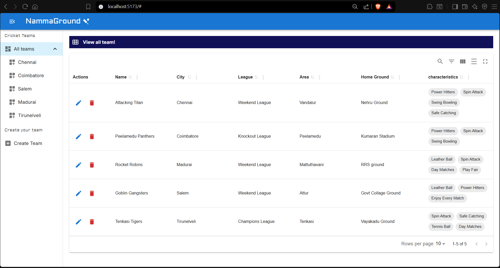
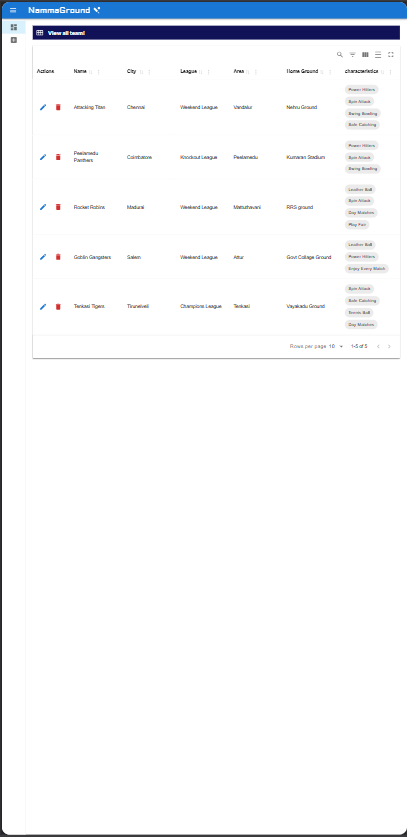

# Full-Stack CRUD Application

A comprehensive full-stack application designed to perform Create, Read, Update, and Delete (CRUD) operations. This project demonstrates the integration of a frontend user interface with a backend API and database.

   ## 📸 Screenshots

| Desktop View | Mobile View |
| :---: | :---: |
|  | 


## 🚀 Features

*   **Create**: Add new records to the database.
*   **Read**: View and fetch existing data from the database.
*   **Update**: Modify existing information seamlessly.
*   **Delete**: Remove records from the system.
*   **Form Validation**: Robust frontend and backend validation to prevent empty submissions, incorrect data formats, and malicious input.
*   **Responsive Design**: Optimized for mobile and desktop screens.

## 🛠 Tech Stack

*   **Frontend**: React.js, Material UI
*   **Backend**: Python, Django REST Framework
*   **Database**: SQLite (built-in)

## 📋 Prerequisites

Ensure you have the following installed on your machine:

*   Python (3.10 or higher)
*   Node.js (latest LTS version)
*   Git

## ⚙️ Installation & Setup

Follow these steps to run the project locally.

### 1. Clone the Repository
```bash
git clone https://github.com
cd your-repo-name
```

### 2. Backend Setup (Django)
```bash
cd backend
python -m venv venv
```
*   **Windows:** `venv\Scripts\activate`
*   **macOS/Linux:** `source venv/bin/activate`

```bash
pip install -r requirements.txt
python manage.py migrate
python manage.py runserver
```
The Django API server will start running at `http://127.0.0`.

### 3. Frontend Setup (React)
Open a new terminal window:
```bash
cd frontend
npm install
npm start
```
The React frontend will start running at `http://localhost:3000/`.

## 🔮 Future Work

*   **User Authentication**: Implement JWT or Django Knox authentication for secure signup and login.
*   **Cloud Database**: Migrate from local SQLite to PostgreSQL or MongoDB Atlas for cloud production data.
*   **Advanced Filtering**: Add complex search filters, sorting mechanisms, and pagination for large datasets.
*   **Cloud Deployment**: Host the application live on platforms like Vercel (Frontend) and Render (Backend).

## 📄 License

Distributed under the MIT License. See `LICENSE` for more information.
